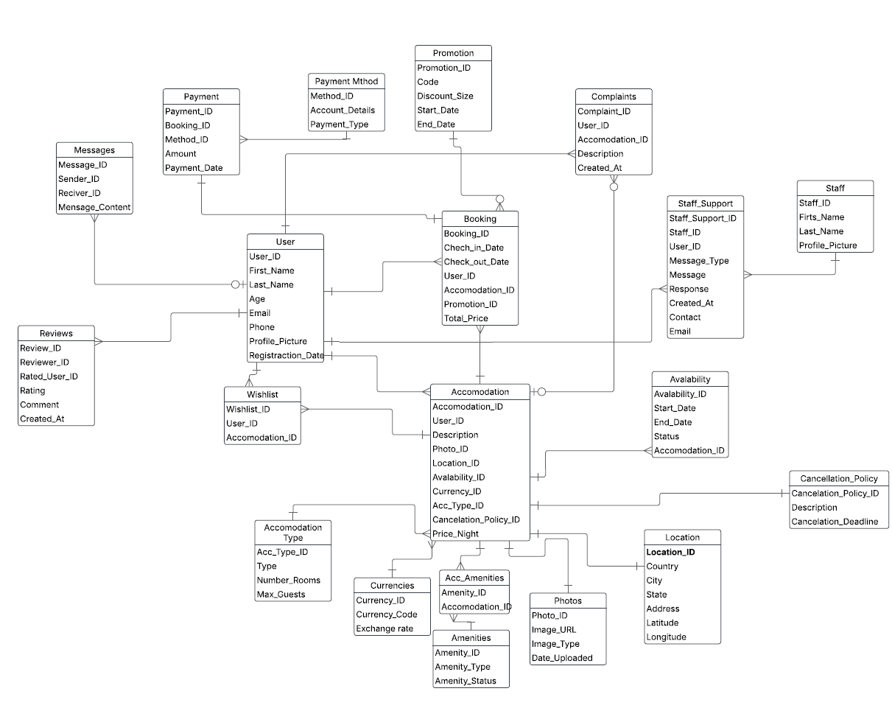

# Airbnb SQL Database Project

## Overview
This project represents a **relational SQL database** designed to model an Airbnb-like system.  
It covers **users, accommodations, bookings, payments, reviews, promotions, complaints, staff support**, and more.  

The database was developed and tested in **MySQL Workbench** and contains realistic data for demonstration and portfolio purposes.  
It includes schema definition (DDL), data insertion (DML), and several example queries showcasing analytical use cases.

---

## Purpose
The goal of this project is to demonstrate the **end-to-end process of designing, implementing, and querying a relational database** with realistic data.  
It can be used as a portfolio project to showcase SQL skills, covering **DDL (Data Definition Language), DML (Data Manipulation Language), and analytical queries**.

---

## Entity–Relationship Model (ERM)
The following ER diagram illustrates the relationships and constraints between the main entities:



---
## Data Dictionary
Below is an overview of the main entities and their purpose in the database:

| Table                  | Description                                                                 |
|-------------------------|-----------------------------------------------------------------------------|
| **Users**              | Stores user details such as name, email, phone, profile picture, and registration date. |
| **Accommodation**      | Listings created by users, including location, description, price per night, type, availability, and cancellation policies. |
| **Booking**            | Records reservations made by users, linked to accommodations, promotions, and payments. |
| **Payment**            | Stores details about completed payments including method, amount, and date. |
| **Payment Method**     | Defines available payment methods such as credit card, PayPal, etc. |
| **Location**           | Stores address details including country, city, state, latitude, and longitude. |
| **Availability**       | Tracks accommodation availability with start and end dates. |
| **Promotion**          | Discount codes and offers with validity periods. |
| **Wishlist**           | Accommodations saved by users for future consideration. |
| **Reviews**            | Ratings and comments that users leave for each other after a stay. |
| **Complaints**         | Issues reported by users related to accommodations. |
| **Staff & Support**    | Staff details and support tickets exchanged between staff and users. |

---

## Example Queries
The repository includes example queries in `sql/dump.sql`. These queries demonstrate:

- **Selecting bookings with user and payment details**
- **Finding available accommodations under a price threshold**
- **Listing active promotions**
- **Displaying reviews with reviewer information**
- **Showing complaints with user and accommodation context**

---

## How to Use

### 1. Restore the Database
To recreate the database, clone the repository and run the dump file:


mysql -u root -p -e "CREATE DATABASE IF NOT EXISTS airbnb_db;"
mysql -u root -p airbnb_db < sql/dump.sql


## Technologies
- **MySQL 8**
- **MySQL Workbench** (for modeling and queries)

---

## Learning Outcomes
Through this project, I practiced:

- Designing a normalized relational database.
- Defining **primary keys, foreign keys, and constraints**.
- Populating tables with realistic mock data.
- Writing **JOINs, filters, and aggregations**.
- Documenting schema with ER diagrams and data dictionaries.

  ```bash


